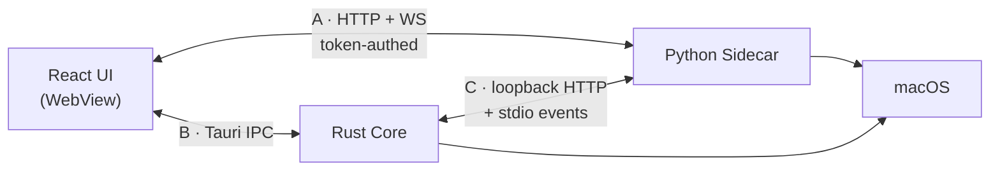

# MITTA — API Design (Phase 2)

Complete interface contract between the three runtimes. Nothing in Phase 3+ may
introduce an endpoint, message type or RPC method that isn't specified here
without a decision-log entry.

Last updated: 2026-07-29

---

## 1. The three interfaces

There are three distinct communication channels, and conflating them is a
recurring source of bugs in applications shaped like this one:

| # | Channel | Direction | Transport | Purpose |
| --- | --- | --- | --- | --- |
| **A** | UI ↔ Sidecar | bidirectional | HTTP + WebSocket on loopback | Agent, memory, projects, tools — all product data |
| **B** | UI ↔ Rust | request/response + events | Tauri IPC | Window control, metrics, keychain, confirmation UI |
| **C** | Rust ↔ Sidecar | bidirectional | HTTP on loopback + stdio events | Secrets, approvals, speech, lifecycle |

The rule that keeps these clean: **the UI never asks Rust for product data, and
never asks the sidecar for OS data.** A metrics reading comes from Rust (DEC-003)
and never round-trips through Python. A memory record comes from Python and
never round-trips through Rust. Violating this creates two paths to the same
fact, which then disagree.



---

## 2. Transport and authentication (Channel A)

**Bind.** `127.0.0.1` on an **ephemeral port** assigned by the OS at bind time
(DEC-004). Never `0.0.0.0`. Never a fixed port.

**Discovery.** On successful bind the sidecar writes a runtime descriptor to
`$MITTA_RUNTIME_DIR/runtime.json` with mode `0600`, then prints one line
`MITTA_READY <port>` to stdout. Rust reads whichever arrives first. The file is
deleted on clean shutdown; a stale file with a dead PID is ignored.

```jsonc
{ "pid": 41288, "port": 52341, "started_at": "2026-07-29T09:41:02Z", "api_version": "1" }
```

**Authentication.** Rust generates a 256-bit token at spawn and passes it to the
child as the `MITTA_SESSION_TOKEN` environment variable — *not* as a CLI
argument, which would expose it in the process list to every local user.

| Transport | How the token travels |
| --- | --- |
| HTTP | `Authorization: Bearer <token>` |
| WebSocket | `Sec-WebSocket-Protocol: mitta.v1, <token>` |

The WebSocket case is deliberate. Browsers forbid custom headers on the
WebSocket handshake, and the common workaround — a `?token=` query parameter —
writes the credential into every access log and into the sidecar's own request
log. The subprotocol header carries it without that exposure. Comparison is
constant-time; failure closes with `4401` before the upgrade completes.

**Origin.** The upgrade handler rejects any request whose `Origin` is not the
Tauri webview origin, closing the local-CSRF path where a page in the user's
browser opens a WebSocket to the sidecar.

---

## 3. HTTP API (Channel A)

Base path `/v1`. JSON in, JSON out. HTTP handles CRUD and configuration;
anything that streams or takes longer than a moment goes over the WebSocket.

### 3.1 Health and system

| Method | Path | Purpose |
| --- | --- | --- |
| `GET` | `/health` | Liveness. **Unauthenticated** — Rust polls it before the token exchange completes |
| `GET` | `/v1/status` | Readiness detail: DB, FAISS, provider health, model load state |
| `GET` | `/v1/capabilities` | What this build supports — feature flags for the UI |

`/health` returning 200 means the process is up. `/v1/status` returning
`"ready": true` means it can serve a turn. The supervisor restarts on the former
failing; the UI shows a connecting state based on the latter.

### 3.2 Conversations and messages

| Method | Path | Purpose |
| --- | --- | --- |
| `GET` | `/v1/conversations` | List. Cursor-paginated, newest first |
| `POST` | `/v1/conversations` | Create |
| `GET` | `/v1/conversations/{id}` | Detail with metadata |
| `PATCH` | `/v1/conversations/{id}` | Rename, pin, archive |
| `DELETE` | `/v1/conversations/{id}` | Delete (cascades to messages) |
| `GET` | `/v1/conversations/{id}/messages` | Message history, cursor-paginated |
| `POST` | `/v1/conversations/{id}/fork` | Branch from a message |

Turns are **not** started over HTTP. A turn streams, so it belongs to the
WebSocket (§4.3). HTTP is for reading history.

### 3.3 Memory

| Method | Path | Purpose |
| --- | --- | --- |
| `GET` | `/v1/memory` | Browse. Filter by `kind`, `project_id`, `status`, importance range |
| `POST` | `/v1/memory` | Create manually |
| `GET` | `/v1/memory/{id}` | Detail with provenance and links |
| `PATCH` | `/v1/memory/{id}` | Edit content or importance — triggers re-embedding |
| `DELETE` | `/v1/memory/{id}` | Forget. Soft by default, `?hard=true` to purge |
| `POST` | `/v1/memory/search` | Hybrid semantic + keyword search |
| `GET` | `/v1/memory/{id}/related` | Semantic neighbours |
| `POST` | `/v1/memory/merge` | Merge duplicates into a survivor |
| `GET` | `/v1/memory/stats` | Counts by kind, index health, embedding coverage |
| `POST` | `/v1/memory/reindex` | Rebuild FAISS from SQLite. Returns a task id |

`POST /v1/memory/search` takes a body rather than query params because the query
can be long, and query strings land in logs — a search over personal memory is
exactly the content R5 exists to keep out of logs.

```jsonc
// POST /v1/memory/search
{
  "query": "what did I decide about the auth flow",
  "kinds": ["long_term", "project", "episodic"],
  "project_id": "prj_01H…",       // optional scope
  "limit": 12,
  "min_importance": 0.2,
  "mode": "hybrid"                 // "semantic" | "keyword" | "hybrid"
}
```

### 3.4 Projects

| Method | Path | Purpose |
| --- | --- | --- |
| `GET · POST` | `/v1/projects` | List, create |
| `GET · PATCH · DELETE` | `/v1/projects/{id}` | Detail, update, delete |
| `GET · POST · DELETE` | `/v1/projects/{id}/paths` | Filesystem roots — also the write-boundary for policy |
| `GET` | `/v1/projects/{id}/memory` | Project-scoped memory |
| `GET` | `/v1/projects/{id}/timeline` | Episodic events for this project |

Project paths are not cosmetic. The policy engine treats "outside a configured
project root" as a CONFIRM trigger (`ARCHITECTURE.md` §9), so this endpoint
edits a security boundary and is itself permission-gated.

### 3.5 Tasks and plans

| Method | Path | Purpose |
| --- | --- | --- |
| `GET` | `/v1/tasks` | Active and recent tasks |
| `GET` | `/v1/tasks/{id}` | Detail with checkpoint state |
| `POST` | `/v1/tasks/{id}/cancel` | Request cancellation |
| `POST` | `/v1/tasks/{id}/resume` | Resume from last checkpoint |
| `GET` | `/v1/plans/{id}` | Full DAG with per-node status |
| `GET` | `/v1/schedules` · `POST` · `DELETE` | Recurring automations |

### 3.6 Tools, plugins, models

| Method | Path | Purpose |
| --- | --- | --- |
| `GET` | `/v1/tools` | Registry with schemas, permissions, destructive flag |
| `PATCH` | `/v1/tools/{name}` | Enable/disable, override permission rule |
| `GET` | `/v1/plugins` | Installed plugins, versions, health |
| `POST` | `/v1/plugins` | Install from path or registry |
| `PATCH · DELETE` | `/v1/plugins/{id}` | Update, grant/revoke permissions, remove |
| `GET` | `/v1/models` | Available models with capabilities and provider health |
| `PUT` | `/v1/models/routing` | Task-class → model preferences |

`GET /v1/models` returns **capabilities, never a vendor name as a behavioural
switch** — `supports_tools`, `supports_vision`, `context_window`,
`cost_per_1k_in/out` (nullable), `requires_auth` (bool). This is DEC-020's
mitigation expressed in the wire format: a local provider that needs no key and
has no cost fits the same shape without a special case.

### 3.7 Security and audit

| Method | Path | Purpose |
| --- | --- | --- |
| `GET` | `/v1/audit` | Policy decisions, filterable, paginated |
| `GET` | `/v1/audit/llm-requests` | **Every outbound payload** (R5 / DEC-016) |
| `GET · PUT` | `/v1/policy/rules` | Permission rules |
| `POST` | `/v1/policy/simulate` | Dry-run: what verdict would this call get? |

`/v1/audit/llm-requests` is the endpoint that makes the privacy claim
verifiable. It returns the exact assembled payload for any turn — messages,
retrieved memories, tool schemas, token counts, provider and model. Without it,
"only what's needed is sent" is a promise; with it, it's an inspectable fact.

### 3.8 Settings and keys

| Method | Path | Purpose |
| --- | --- | --- |
| `GET · PATCH` | `/v1/settings` | Configuration |
| `GET` | `/v1/settings/keys` | Which providers **have** a key. Never the values |
| `POST` | `/v1/settings/keys/{provider}/test` | Validate a stored key with a cheap live call |

**API keys never transit this API.** The settings UI sends a key to *Rust* over
Tauri IPC (Channel B), Rust writes it to the Keychain, and Python requests it
over Channel C at use time and holds it only in memory. There is deliberately no
`POST /v1/settings/keys` accepting a secret — an endpoint that accepts a key is
an endpoint that logs a key the first time someone enables request logging.

---

## 4. WebSocket API (Channel A)

Endpoint: `GET /v1/ws` (upgrade). One connection per window; both windows'
connections observe the same server-side state, which is how DEC-018's
single-state-layer requirement holds across two webviews.

### 4.1 Envelope

Every frame in both directions:

```jsonc
{
  "id":   "msg_01HQ…",      // ULID, unique per frame
  "type": "turn.delta",     // dot-namespaced; namespace = subsystem
  "ts":   "2026-07-29T09:41:02.881Z",
  "ref":  "trn_01HQ…",      // correlates to the originating request, if any
  "data": { }
}
```

A uniform envelope means one codec, one logger, one replay tool, and one place
to add tracing later. Namespacing by subsystem lets the UI subscribe by prefix
instead of enumerating every type.

### 4.2 Subscriptions

The client opts into what it wants. The palette window subscribes to almost
nothing, which is part of how it meets its open-latency budget.

```jsonc
→ { "type": "subscribe",   "data": { "channels": ["turn", "task", "notification"] } }
→ { "type": "unsubscribe", "data": { "channels": ["task"] } }
```

### 4.3 Turn lifecycle — client → server

```jsonc
→ {
  "type": "turn.start",
  "data": {
    "conversation_id": "cnv_01HQ…",
    "project_id":      "prj_01HQ…",     // optional scope
    "input": { "kind": "text", "text": "clean up my downloads folder" },
    "options": { "personality": true, "voice_output": false, "model": null }
  }
}

→ { "type": "turn.cancel",  "ref": "trn_01HQ…" }
→ { "type": "turn.approve", "ref": "req_01HQ…",
    "data": { "approval_token": "<rust-signed>", "decision": "approve" } }
```

`input.kind` is `"text"` or `"voice"`. Voice turns arrive here already
transcribed — audio never crosses Channel A, because the native speech layer
(DEC-019) transcribes and hands text to Python over Channel C. Audio bytes never
enter the Python process at all.

### 4.4 Turn lifecycle — server → client

Ordered by when they appear in a turn:

| Type | Data | Notes |
| --- | --- | --- |
| `turn.accepted` | `turn_id`, `conversation_id` | Assigns the id everything else references |
| `turn.context` | memory hits, token budget, payload id | Feeds the "what was sent" UI |
| `turn.thinking` | `phase`, `label` | Drives the thinking indicator. Phases: `retrieving` · `planning` · `reasoning` · `executing` · `styling` |
| `turn.delta` | `text` | Streamed token chunk. **Pre-personality** (§4.5) |
| `turn.tool.proposed` | tool, params, verdict | Emitted before execution, always |
| `turn.tool.confirm` | `request_id`, tool, params, risk, expires_at | CONFIRM verdict — blocks until answered |
| `turn.tool.started` | invocation id | |
| `turn.tool.result` | result or error, duration | |
| `turn.message` | full message record | The persisted, **post-personality** text |
| `turn.error` | code, message, retryable | Terminal |
| `turn.done` | usage, model, provider, duration | Terminal |

### 4.5 How streaming and the personality layer coexist

These requirements are in direct tension. Streaming demands emitting tokens as
they arrive; DEC-008 demands the personality rewrite run on the *complete* final
response. You cannot restyle text you haven't finished receiving.

The resolution: **stream the reasoning output live as `turn.delta`, then send
the styled text once as `turn.message`, and have the UI replace the streamed
buffer in place.** The user sees immediate output (first-token latency is
unaffected, satisfying the performance requirement) and then a single settle to
the final phrasing. The replacement is one atomic swap with a brief crossfade,
not a token-by-token re-render.

The honest cost: with personality enabled the visible text changes once after
the stream completes. It is a real artefact and not hidden. Three mitigations
are specified now rather than discovered later:

1. **Register bounds the swap in both directions.** The turn carries a
   `register` of `playful` or `serious` (`PERSONALITY_PROFILE.md`). Playful
   replies are 1–8 words, so the swap is small and near-instant. Serious replies
   are barely restyled — punctuation and sentence case survive — so the swap is
   also small. The pathological case, heavy rewriting of a long response, is not
   a register the system produces.
2. At intensity zero the layer is a no-op and no replacement occurs.
3. `turn.message` carries `styled: true|false` so the UI can skip the swap when
   the rewrite returned the input unchanged.

`register` is computed upstream, before styling, and is reported on
`turn.thinking` (phase `styling`) and `turn.message`. The client never sets it —
it is derived from forced-serious categories, the user's own register, and
whether the content can be compressed without loss. Exposing it on the wire lets
the UI show why a reply came back long, and makes the classifier's behaviour
inspectable rather than mysterious.

### 4.6 Other channels

| Type | Direction | Purpose |
| --- | --- | --- |
| `task.created` · `task.progress` · `task.completed` · `task.failed` | → client | Planner execution |
| `plan.updated` | → client | DAG node status changed |
| `memory.created` · `memory.updated` · `memory.forgotten` | → client | Keeps the memory explorer live |
| `notification.new` | → client | Notification centre |
| `provider.health` | → client | Failover happened; model selector updates |
| `voice.transcript.partial` · `voice.transcript.final` | → client | Relayed from native for the waveform/caption UI |
| `plugin.status` | → client | Plugin crashed, restarted, updated |

System metrics are **absent by design**. CPU/RAM/GPU/battery flow over Channel B
from Rust (DEC-003). Routing them through Python would add a hop, a
serialisation and a poll loop to the one thing that runs every second for the
whole session.

### 4.7 Reconnection

The client reconnects with exponential backoff and jitter, then sends
`resume` with the last received frame `id`. The server replays buffered frames
for in-flight turns from a bounded per-connection ring buffer; if the buffer has
rolled past that point it replies `resume.gap` and the client refetches state
over HTTP. A dropped WebSocket must never abort a running turn — turns are owned
by the sidecar, not by the socket.

---

## 5. Error model

One shape everywhere, HTTP and WebSocket alike:

```jsonc
{
  "error": {
    "code": "policy.denied",
    "message": "Deleting outside a project root requires confirmation.",
    "retryable": false,
    "details": { "tool": "files.delete", "path": "/Users/satya/Documents" },
    "request_id": "req_01HQ…"
  }
}
```

Codes are dot-namespaced and stable — the UI switches on `code`, never on
`message`, so wording can change without breaking clients.

| Namespace | Meaning | HTTP |
| --- | --- | --- |
| `auth.*` | Missing or invalid session token | 401 |
| `validation.*` | Schema violation | 422 |
| `not_found.*` | Unknown resource | 404 |
| `policy.*` | Denied or confirmation required | 403 |
| `provider.*` | Upstream LLM failure — `retryable` matters here | 502 / 503 |
| `plugin.*` | Plugin crashed, timed out, or lacks permission | 500 |
| `storage.*` | Database or index failure | 500 |
| `internal.*` | Unexpected | 500 |

`provider.*` errors always carry `retryable` and, on failover, which provider
was tried. The user should never see a bare "request failed" when the real story
is "Groq rate-limited, OpenRouter served it" — that transparency is required by
R3 and is cheap to provide here.

---

## 6. Versioning and compatibility

The path carries `/v1`. The shell and sidecar ship as one bundle, so version
skew is not a normal condition — but it happens during development and after a
partial update, and it should fail loudly rather than mysteriously.

Rust compares the sidecar's `api_version` against its own expectation at
handshake. Mismatch surfaces as a clear error in the UI instead of a cascade of
decoding failures. Plugins are versioned independently (§ `PROJECT_STRUCTURE.md`)
and declare a compatible core range in their manifest.

---

## 7. Channel B — UI ↔ Rust (Tauri IPC)

Typed commands invoked from the frontend:

| Command | Purpose |
| --- | --- |
| `get_runtime_info` | Sidecar port + session token, so the UI can open Channel A |
| `subscribe_metrics` / `unsubscribe_metrics` | Start/stop the 1 Hz metrics event stream |
| `store_api_key(provider, key)` | Write to Keychain. **The only path a key ever takes** |
| `has_api_key(provider)` / `delete_api_key(provider)` | Presence check, removal. Never reads a value back to the UI |
| `request_confirmation(request)` | Render the native confirmation dialog (DEC-010) |
| `capture_screenshot(opts)` | Needs the Screen Recording entitlement |
| `window_show` / `window_hide` / `toggle_palette` | Window control |
| `open_path(path)` / `reveal_in_finder(path)` | Shell integration |
| `get_permissions_status` | Accessibility · Screen Recording · Microphone — drives onboarding |

Rust → UI events: `metrics:update` (1 Hz), `hotkey:triggered`,
`sidecar:state` (`starting` · `ready` · `restarting` · `failed`),
`permission:changed`, `speech:*`.

`store_api_key` is the whole reason Channel B exists in this form. The key goes
from the settings input directly to Rust to the Keychain. It never enters the
Python process's memory except transiently at use time, never appears in an HTTP
body, and never reaches a log formatter.

---

## 8. Channel C — Rust ↔ Sidecar

Small, security-critical, and deliberately narrow.

### 8.1 Sidecar → Rust (loopback HTTP, mutually token-authed)

| Method | Purpose |
| --- | --- |
| `secrets.get(provider)` | Fetch an API key at use time. Rust logs the access; Python never persists the value |
| `confirmation.request(payload)` | Ask Rust to render a dialog. Returns a signed approval token or a denial |
| `speech.speak(text, voice, interruptible)` | TTS request |
| `speech.stop()` | Barge-in — cancel current utterance |
| `notification.post(payload)` | Native notification |

### 8.2 Rust → Sidecar (events over the child's stdin, newline-delimited JSON)

| Event | Purpose |
| --- | --- |
| `speech.transcript.partial` / `.final` | Streaming recognition results |
| `speech.wake` | Wake-word activation (mechanism undecided — R7, Phase 6) |
| `speech.vad` | Voice-activity start/stop |
| `hotkey.triggered` | Global hotkey pressed |
| `shutdown` | Graceful stop: finish or checkpoint in-flight turns, then exit |

stdio is used for Rust→Python rather than a second HTTP channel because these
are high-frequency, ordered, fire-and-forget events on the latency-sensitive
audio path, and because it costs nothing — the pipe already exists from the
spawn.

### 8.3 The approval token

The single most security-relevant structure in the system (DEC-010):

```jsonc
{
  "token_id":     "apv_01HQ…",
  "tool":         "files.delete",
  "params_hash":  "sha256:9f2c…",       // binds to these exact arguments
  "turn_id":      "trn_01HQ…",
  "issued_at":    "2026-07-29T09:41:02Z",
  "expires_at":   "2026-07-29T09:43:02Z",
  "nonce":        "…",
  "signature":    "hmac-sha256(session_key, canonical_json(above))"
}
```

Four properties, each closing a specific attack:

- **Signed with a key only Rust holds** — Python cannot mint one, so a
  prompt-injected agent cannot approve itself.
- **Bound to a hash of the exact parameters** — approval for
  `delete ~/Downloads/tmp` cannot be replayed for `delete ~/Documents`.
- **Single-use**, tracked by `token_id` in the database — no replay.
- **Two-minute expiry** — an approval left open cannot be used an hour later
  against different state.

Python verifies signature, expiry, single-use status and a recomputed parameter
hash before dispatch. Any failure is a `policy.*` error and an audit entry.

---

## 9. Rate limiting, timeouts, backpressure

Loopback removes the usual abuse concerns but not the resource concerns.

| Concern | Handling |
| --- | --- |
| Concurrent turns | One active turn per conversation; a second returns `409` with the running turn id |
| Tool timeouts | Per-tool timeout in the manifest, default 30 s; hard-killed on expiry |
| Plugin timeouts | 10 s per call; the plugin process is restarted after repeated failures |
| LLM timeouts | 60 s streaming, 20 s to first token, then failover to the other provider |
| WebSocket backpressure | Bounded per-connection send queue; on overflow, coalesce `turn.delta` frames rather than dropping lifecycle frames |
| Embedding queue | Bounded background queue; writes are async and never block a turn |

The backpressure rule is worth stating explicitly: under pressure, **text deltas
may be merged, lifecycle events may not be dropped.** Losing a delta costs a
rendering artefact; losing a `turn.done` leaves the UI spinning forever.
