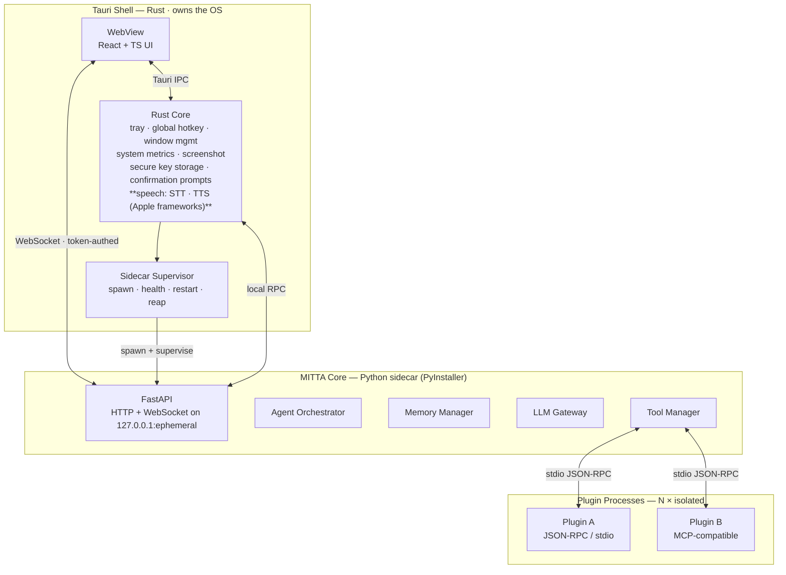
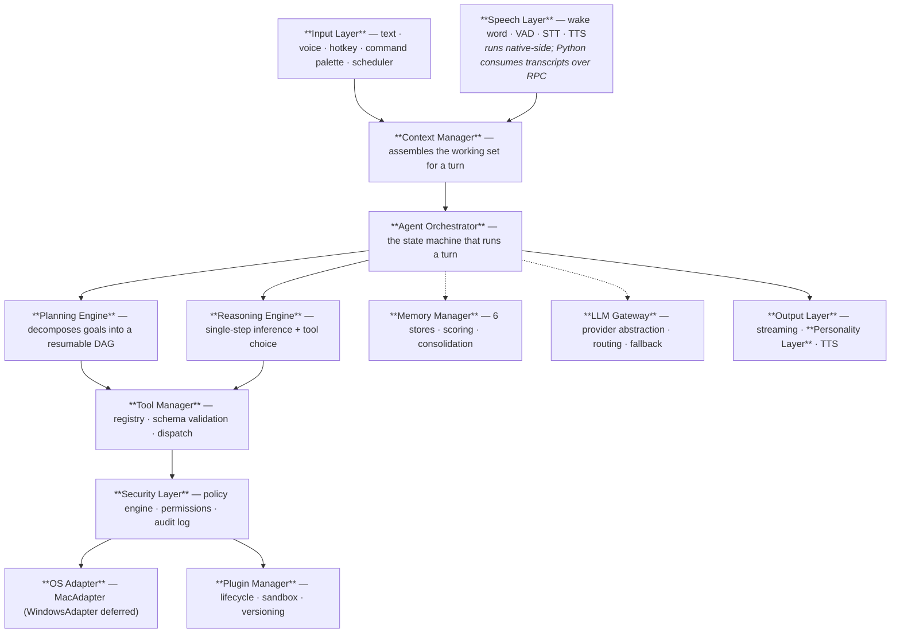
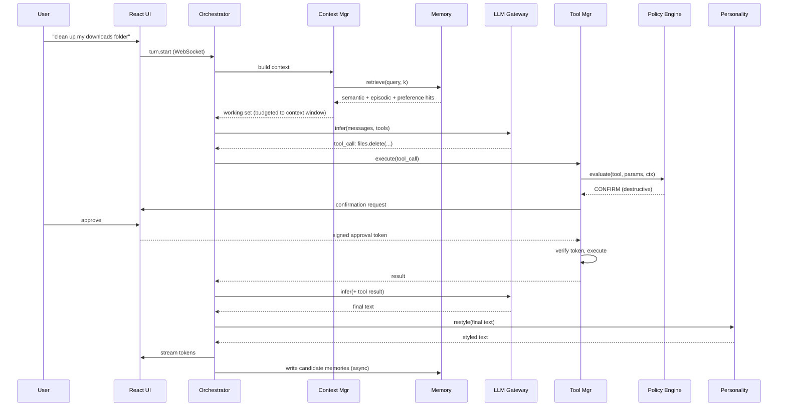

# MITTA — System Architecture (Phase 1)

Status: **Amended — see `REQUIREMENTS.md`, which supersedes this document**
Platform: **macOS-first.** macOS Sequoia (15)+, Apple Silicon primary.
Windows: abstraction preserved, implementation deferred. Not built now.
Last updated: 2026-07-29

---

## 1. Product Definition

MITTA is a local-first desktop AI companion. It is not a chat window with a
model behind it — it is a supervised agent runtime that happens to have a chat
surface.

Three properties define it, and every decision in this document is downstream of
them:

1. **Local-first.** The system of record lives on the user's disk. Cloud models
   are an accelerator, never a dependency. Pull the network cable and MITTA
   still remembers, still plans, still executes.
2. **Real actions, guarded.** It runs shell commands, deletes files and sends
   mail. Therefore every action passes a policy engine before it touches the OS,
   and the approval path cannot be short-circuited by the component requesting
   the action.
3. **Personality is a skin, not a brain.** Reasoning quality must be identical
   whether personality is on or off. The style layer is the last stage of the
   pipeline and is structurally incapable of changing a decision.

### Non-goals for v1

Explicitly out of scope so they don't leak into the design: **Windows
implementation**, multi-user accounts, team sync, a hosted backend, mobile
clients, and any telemetry that leaves the machine.

The Windows *abstraction* is still built (R1). Only the implementation is
deferred.

---

## 2. Process Topology

MITTA runs as three processes on one machine. No network listeners are exposed
beyond loopback.



### Why a compiled Python sidecar

The alternative — bootstrapping a `uv` venv against the user's system Python —
is materially nicer during development and materially worse in production. It
fails on machines with no Python, with Microsoft Store Python, with a corporate
PATH, or with antivirus that objects to a process writing executables into
`AppData`. Those failures land on first launch, which is the worst possible
moment.

PyInstaller moves that cost to *our* build pipeline, where it is a solved and
repeatable problem. The user gets one installer and no prerequisites. The price
is a 150–300 MB bundle and a slower release build, both acceptable.

### Why Rust owns the OS and Python owns automation

This split is not arbitrary. Rust already holds the window handles, the event
loop and the accessibility permissions — it is the natural home for anything
needing them. Sampling CPU/GPU/battery every second from Python is also
measurably wasteful; `sysinfo` in Rust costs a fraction of the RAM and CPU that
a `psutil` poll loop does, and this runs for the entire session.

| Concern | Owner | Reason |
| --- | --- | --- |
| Tray, global hotkey, window management | Rust | Needs the event loop |
| System metrics (CPU/RAM/GPU/battery) | Rust | Runs continuously; must be cheap |
| Screenshot capture | Rust | Needs Screen Recording entitlement |
| Secret storage | Rust | macOS Keychain bindings |
| Confirmation dialogs | Rust | Must be untamperable by the requester |
| **Speech — STT and TTS** | **Rust / Swift** | **Apple's Speech and AVFoundation frameworks are Swift/ObjC-only** |
| App automation (AppleScript) | Python | Business logic, iterated often |
| File ops, git, docker, browser | Python | Business logic, iterated often |
| Reasoning, memory, planning | Python | The AI ecosystem lives here |

### Sidecar security

The sidecar binds `127.0.0.1` on an **ephemeral port**, not a fixed one, so a
second MITTA or a hostile local process cannot squat it. Rust generates a
256-bit session token at spawn, passes it via environment variable, and every
HTTP and WebSocket request must present it. The port is written to a
user-only-readable runtime file. On shell exit the supervisor SIGTERMs then
SIGKILLs the child — an orphaned sidecar holding an open agent loop is a real
failure mode and is handled explicitly.

---

## 3. Layered Architecture

Each layer depends only on the interfaces of the layer below, never on its
implementation. Wiring happens once in a composition root at startup.



The one rule worth stating loudly: **the Security Layer sits between the Tool
Manager and the OS Adapter.** There is no code path from reasoning to the
operating system that bypasses policy evaluation. That is enforced structurally —
the Tool Manager is not given a reference to the OS Adapter at all.

---

## 4. Turn Data Flow

A single user turn, from keystroke to spoken reply:



Two details that matter. **Memory writes are asynchronous** and off the response
path — the user should never wait on embedding generation. And **the personality
layer runs only on the final natural-language response**, never on intermediate
tool-calling turns, because rewriting a tool call would corrupt it.

---

## 5. Memory Architecture

Six stores, one manager, two physical backends.

| Store | Lifetime | Backing | Purpose |
| --- | --- | --- | --- |
| Working | Current session | RAM | Active conversation, evicted on close |
| Long-term | Permanent | SQLite + FAISS | Stable user facts |
| Semantic | Permanent | FAISS | Meaning-based retrieval over all stores |
| Project | Per project | SQLite + FAISS | Scoped repos, files, decisions, tasks |
| Episodic | Permanent | SQLite | Time-ordered log of meaningful events |
| Preference | Permanent | SQLite | Settings and learned behavioural defaults |
| Relationship | Permanent | SQLite | People, roles, connections |

**SQLite is the system of record. FAISS is a derived cache.** Every vector row
carries the SQLite id it came from, and the index can be rebuilt from scratch by
re-embedding. This inverts the usual fragility: a corrupted FAISS file becomes a
30-second rebuild instead of permanent data loss. SQLite runs in WAL mode so
background consolidation doesn't block reads.

### Embeddings: local, always

`bge-small-en-v1.5` via ONNX Runtime — 384 dimensions, ~130 MB, fast on CPU, no
key, no network, no per-token cost. Cloud embeddings were rejected because every
memory write would become a billable network round-trip and memory would stop
working offline, which contradicts the first principle of the product. The
embedding model is pinned; changing it requires a full re-index, so the model id
is recorded per-vector to make migration detectable.

### What the Memory Manager decides

Not every utterance is a memory. A write goes through: **extract** candidate
facts → **score** importance (0–1) → **deduplicate** against semantic
neighbours above a similarity threshold → **merge or insert** → **decay** unused
low-importance rows over time. Consolidation runs on idle, not on the hot path.

---

## 6. LLM Gateway — Free-First Routing

You asked for free and best. Those pull in opposite directions, so the gateway
resolves them per task class rather than picking one model globally.

Confirmed provider set for v1 — **Groq** and **OpenRouter**, both BYOK, with
automatic failover between them (R3):

```
Primary    Groq         fast inference, free tier
Secondary  OpenRouter   broad model catalogue, itself a multi-provider gateway
Deferred   Ollama · LM Studio · Anthropic · OpenAI · Gemini · DeepSeek
```

OpenRouter is a useful second leg specifically because it is not a single
vendor — if Groq is rate-limited or down, OpenRouter can serve a comparable
model without a code change. Failover is health-based, not round-robin: a
provider is marked unhealthy on rate-limit, timeout or 5xx, retried with
exponential backoff, and the active provider is always visible in the UI so the
user is never guessing who answered.

| Task class | Routing preference | Rationale |
| --- | --- | --- |
| Planning / multi-step reasoning | Best available | Quality dominates; this is where weak models fail |
| Single-shot chat | Tier 1 → Tier 0 | Groq is fast and free |
| Personality rewrite | Cheapest + fastest | Runs on every reply; latency is felt directly |
| Summarisation / consolidation | Tier 0 preferred | Background work, latency irrelevant |
| Embeddings | **Always local** | Never billable, never networked |

Every provider is normalised behind one interface exposing streaming,
tool-calling, vision support, context window and cost-per-token. The
orchestrator sees capabilities, never a vendor name. Fallback is automatic on
rate-limit, timeout or outage, and the chosen model is surfaced in the UI so the
user is never confused about who answered.

The honest trade-off: local models are noticeably worse at multi-step
tool-calling. Fully offline, the planner degrades. The architecture makes that a
graceful degradation rather than a failure, but it is real.

---

## 7. Personality Layer

The dataset in `MITTA_AI_MASTER_STYLE_GUIDE.pdf` is used to build a **structured
style profile** — sentence length distribution, punctuation and capitalisation
habits, vocabulary bias, humour register, greeting and closing conventions. No
conversation content is stored or reproduced.

The profile is applied as a constrained rewrite of the final response:

```
Reasoning Engine → Tool Execution → Final Response → Personality Layer → User
                                                            │
                                    style profile (JSON) ───┘
```

Hard constraints on the rewrite stage, because a style pass that alters meaning
is a correctness bug:

- **Code blocks, file paths, commands and URLs pass through byte-identical.**
- Facts, numbers and decisions may not change — only their expression.
- Refusals and safety-relevant text are not restyled.
- Confirmation prompts for destructive actions are never restyled; ambiguity
  there is dangerous.
- The layer is toggleable and has an intensity setting; at zero it is a no-op.

Because it is the last stage and takes only text in and text out, it cannot
influence reasoning. That isolation is the whole point.

---

## 8. Tool & Plugin System

Every tool declares a manifest: name, description, JSON Schema parameters,
required permissions, whether it is destructive, and a handler. The schema is
what gets exposed to the model, so it is the single source of truth for both
validation and prompting.

**Plugins run out-of-process** — separate subprocesses speaking JSON-RPC over
stdio. In-process plugins were rejected on two grounds: one bad plugin would
take down the whole assistant, and a plugin sharing the interpreter could reach
around the policy engine.

The wire protocol is **MCP-compatible**, which is the highest-leverage decision
in this section: the existing ecosystem of MCP servers becomes installable
MITTA plugins on day one, at no additional engineering cost.

---

## 9. Security Model

The policy engine evaluates every tool invocation and returns one of three
verdicts:

```
ALLOW    → execute immediately          (read file, get weather, clipboard read)
CONFIRM  → require explicit approval    (delete, shell, email, install, shutdown)
DENY     → refuse and log               (blocked by user rule or permission)
```

Default-CONFIRM actions: file/folder deletion, shell execution, sending email or
messages, package installation, system shutdown or restart, and any write
outside configured project roots.

The critical property: **the confirmation dialog is rendered by the Rust shell,
not the Python process that wants the action.** Approval returns a signed,
single-use, expiring token bound to that exact tool call. The requesting
component cannot mint its own approval. Without this, a prompt-injected agent
could approve its own `rm -rf`.

All decisions — allowed, confirmed and denied — append to a local audit log.

### Privacy enforcement (R5)

Local-first is a hard constraint, so it is enforced at a chokepoint rather than
by convention. **Context assembly is the only component permitted to build an
outbound payload**, and it applies a strict budget: retrieved working set for
the current turn only, never a store dump, never a full-table scan.

- The memory database is never uploaded, in whole or in part beyond the working
  set for the active turn.
- Embeddings are computed locally, so semantic retrieval never touches the
  network. This is what makes the constraint achievable rather than aspirational.
- Every outbound payload is recorded locally and is inspectable in the UI —
  the user can see exactly what was sent for any turn.
- Nothing leaves the machine except requests to the configured LLM APIs. No
  telemetry, no analytics, no remote crash reporting.

---

## 10. Storage Layout

One configurable root, defaulting to the macOS convention
`~/Library/Application Support/MITTA`. The path is resolved by the OS Adapter,
never hardcoded above it:

```
mitta.db          SQLite — memories, projects, tasks, audit log, plugin registry
vectors/          FAISS indices + id maps (derived, rebuildable)
models/           Embedding, wake word, STT, TTS models
config/           JSON config; secrets NEVER here
logs/             Structured JSON logs, rotated
projects/         Per-project working data
screenshots/      Captures
voice_cache/      Synthesised audio cache
plugins/          Installed plugins + their data
```

**Secrets never touch this tree.** API keys live in the **macOS Keychain**,
written by the Rust layer. Python receives them through an authenticated request
at use time and never persists them — not to config, not to logs, not to the
crash path. Keys are entered through the settings UI so they never transit a
file or the shell history, and log formatters carry a redaction filter for
anything matching a key pattern.

---

## 11. Performance Strategy

| Target | Approach |
| --- | --- |
| Fast startup | Rust shell renders immediately; sidecar boots in parallel; UI shows a connecting state rather than blocking |
| Low RAM | Lazy-load STT/TTS/embedding models on first use, unload on idle |
| Low CPU | Metrics sampled in Rust at 1 Hz; no Python poll loop |
| Streaming | Tokens streamed over WebSocket; personality applied to the final buffer, so first-token latency is unaffected |
| Retrieval | FAISS in-memory, capped candidate set, SQLite hydration only for winners |
| Indexing | Embedding and consolidation on a background worker, off the response path |

---

## 12. Repository Shape

**Superseded by `PROJECT_STRUCTURE.md` (Phase 2), which is now canonical for
layout.** The API contract is in `API_DESIGN.md` and the schema in
`DATABASE_DESIGN.md`. The top level, for orientation:

```
mitta/
├── apps/desktop/        Tauri shell (Rust) + React/TS frontend
├── core/                Python: agent, memory, planner, llm, security, voice, os
├── plugins/             First-party plugins
├── config/              Default configuration
├── tests/               Unit + integration
├── docs/                Architecture, decisions, guides
└── scripts/             Build, package, sign, release
```

---

## 13. Known Limitations

Stated up front rather than discovered later:

1. **Apple Silicon GPU utilisation has no unprivileged API.** `powermetrics`
   requires root, which this product will not ask for. The UI will show GPU as
   unavailable rather than fabricate a number. CPU, RAM and battery are all
   fully available.
2. **Local models degrade multi-step planning.** Fully offline, complex task
   decomposition will be visibly weaker than with a frontier model.
3. **Apple provides no wake-word API.** `SpeechAnalyzer`/`SFSpeechRecognizer`
   transcribe; they do not detect a trigger phrase. With the native stack chosen,
   wake-word activation needs a decision at Phase 6 — continuous on-device
   transcription with a string match (simple, costs battery), a small local
   detector feeding Apple STT (efficient, reintroduces a model download), or
   hotkey-only activation (free, no wake word). **Open — do not assume.**
4. **Installer size.** 250–400 MB once Python and the local models are bundled.
   macOS supplies the webview, so there is no Chromium to ship. This is inherent
   to a local-first product.
5. **Code signing is required for distribution** — an Apple Developer account
   ($99/yr) for signing and notarisation. Unsigned builds are blocked by
   Gatekeeper. Not needed to run locally on your own machine during development.
6. **First launch requires permission grants** on macOS (Accessibility, Screen
   Recording, Microphone) which cannot be scripted and need a guided onboarding
   flow.
