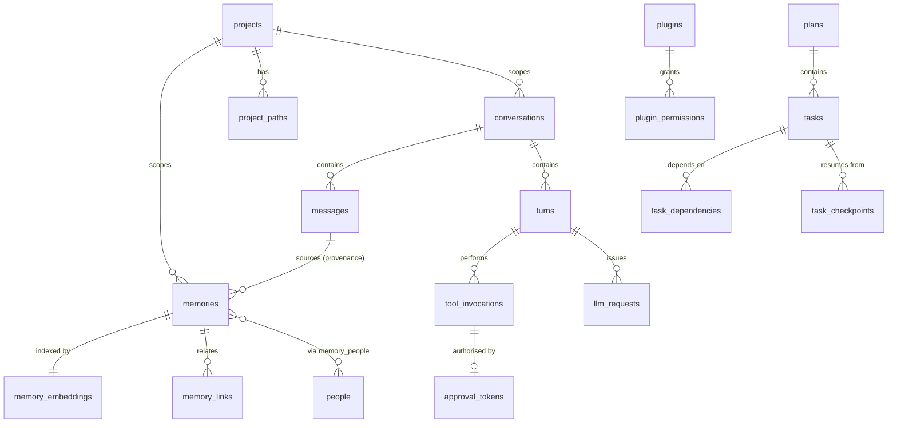

# MITTA — Database Design (Phase 2)

Complete schema for the local SQLite database and its relationship to the FAISS
index. This is the design of record; migrations in Phase 3+ implement it
verbatim or amend it through the decision log.

Engine: **SQLite 3.45+ (bundled), WAL mode**
Vector index: **FAISS — derived, rebuildable** (DEC-005)
Last updated: 2026-07-29

---

## 1. Conventions applied throughout

Six choices are applied uniformly. Each is stated once here rather than
justified repeatedly in the DDL.

**Dual keys — `seq` and `id`.** Every table that participates in the vector
index or is referenced externally carries both an `INTEGER PRIMARY KEY
AUTOINCREMENT` (`seq`) and a `TEXT UNIQUE` public identifier (`id`). `AUTOINCREMENT`
is not decorative here: without it SQLite reuses rowids after deletion, and a
reused rowid means a stale FAISS vector silently resolves to a *different*
memory. That is a correctness bug that surfaces as the assistant confidently
recalling something the user never said. `AUTOINCREMENT` guarantees monotonic,
never-reused integers, which is exactly the contract a FAISS `IDMap` needs.

**Public ids are prefixed ULIDs** — `mem_01HQ8…`, `cnv_01HQ8…`. Lexicographically
sortable by creation time, and the prefix means a stray identifier in a log or a
bug report is self-describing.

**Timestamps are `INTEGER` milliseconds since the Unix epoch, UTC.** ISO-8601
text is nicer to read in a database browser, but it is larger, slower to
range-scan, ambiguous about offset, and awkward for the decay arithmetic in §4.4.
Readability is recovered with the `v_*` views in §11 rather than paid for on
every row.

**JSON columns are validated.** Anything storing structured attributes carries
`CHECK (json_valid(col))`. SQLite will otherwise happily store a truncated blob
and fail at read time, far from the cause.

**Soft delete is the default for memory.** `status` moves to `forgotten` and the
row survives. A user who says "forget that" and then "actually, undo" should not
be met with permanent loss, and forgetting is a memory-quality operation rather
than a storage operation. Hard deletion exists (`?hard=true`) and is genuinely
irreversible.

**Foreign keys are enforced.** `PRAGMA foreign_keys = ON` on every connection —
it is off by default in SQLite, which is a well-known way to end up with orphans
in a schema that looks fully constrained.

---

## 2. Connection configuration

```sql
PRAGMA journal_mode  = WAL;          -- readers never block the consolidation writer
PRAGMA synchronous   = NORMAL;       -- WAL-safe; FULL costs latency for little gain here
PRAGMA foreign_keys  = ON;
PRAGMA busy_timeout  = 5000;         -- 5s, rather than an immediate SQLITE_BUSY
PRAGMA temp_store    = MEMORY;
PRAGMA cache_size    = -20000;       -- ~20 MB page cache
PRAGMA mmap_size     = 268435456;    -- 256 MB
PRAGMA auto_vacuum   = INCREMENTAL;
```

WAL is the load-bearing one. Memory consolidation runs on a background worker
while the user is mid-conversation; in rollback-journal mode that writer would
block every read and the UI would stutter on exactly the interaction that must
feel fast.

**Concurrency model.** SQLite permits one writer. The sidecar therefore holds a
**single serialised write connection** and a small **read connection pool**.
Attempting concurrent writes from multiple connections and relying on
`busy_timeout` to sort it out produces intermittent, load-dependent failures;
serialising writes in application code makes the constraint explicit and
testable.

---

## 3. Schema overview



---

## 4. Memory

The centre of the product. Six conceptual stores (`ARCHITECTURE.md` §5), backed
by **one table with a `kind` discriminator** rather than six tables (DEC-023).

### 4.1 `memories`

```sql
CREATE TABLE memories (
    seq              INTEGER PRIMARY KEY AUTOINCREMENT,
    id               TEXT    NOT NULL UNIQUE,          -- mem_<ULID>

    kind             TEXT    NOT NULL
                     CHECK (kind IN ('long_term','project','episodic',
                                     'relationship','preference','procedural')),
    project_id       TEXT    REFERENCES projects(id) ON DELETE CASCADE,

    content          TEXT    NOT NULL,                 -- the fact, as stored
    summary          TEXT,                             -- short form for context packing
    attributes       TEXT    NOT NULL DEFAULT '{}'
                     CHECK (json_valid(attributes)),   -- kind-specific fields

    importance       REAL    NOT NULL DEFAULT 0.5
                     CHECK (importance BETWEEN 0.0 AND 1.0),
    confidence       REAL    NOT NULL DEFAULT 1.0
                     CHECK (confidence BETWEEN 0.0 AND 1.0),

    status           TEXT    NOT NULL DEFAULT 'active'
                     CHECK (status IN ('active','superseded','forgotten')),
    superseded_by    TEXT    REFERENCES memories(id) ON DELETE SET NULL,

    source_kind      TEXT    NOT NULL
                     CHECK (source_kind IN ('conversation','tool','user',
                                            'import','consolidation')),
    source_message_id TEXT   REFERENCES messages(id) ON DELETE SET NULL,

    content_hash     TEXT    NOT NULL,                 -- sha256 of normalised content
    pinned           INTEGER NOT NULL DEFAULT 0 CHECK (pinned IN (0,1)),
    access_count     INTEGER NOT NULL DEFAULT 0,
    last_accessed_at INTEGER,
    expires_at       INTEGER,                          -- NULL = no TTL

    created_at       INTEGER NOT NULL,
    updated_at       INTEGER NOT NULL
);

CREATE INDEX idx_memories_kind_status   ON memories(kind, status);
CREATE INDEX idx_memories_project       ON memories(project_id, status)
                                        WHERE project_id IS NOT NULL;
CREATE INDEX idx_memories_importance    ON memories(importance DESC, status);
CREATE INDEX idx_memories_created       ON memories(created_at DESC);
CREATE INDEX idx_memories_hash          ON memories(content_hash);
CREATE INDEX idx_memories_expiry        ON memories(expires_at)
                                        WHERE expires_at IS NOT NULL;
```

`attributes` holds what differs by kind, validated against a per-kind Pydantic
model in the repository layer:

| Kind | Attributes |
| --- | --- |
| `long_term` | `category`, `entities[]` |
| `project` | `artifact_type`, `path`, `commit_sha` |
| `episodic` | `occurred_at`, `event_type`, `participants[]` |
| `relationship` | `person_id`, `relation`, `sentiment` |
| `preference` | `domain`, `polarity`, `derived_from` |
| `procedural` | `trigger`, `steps[]`, `success_count` |

`procedural` is not in the original six. It exists because "learn my workflows"
is a stated product goal, and a learned workflow is neither a fact nor an event —
it is a repeatable procedure with a trigger and a success record. Folding it into
`long_term` would make it unretrievable as a *procedure*, which is the only way
it is useful.

### 4.2 Full-text index

```sql
CREATE VIRTUAL TABLE memories_fts USING fts5(
    content, summary,
    content='memories',
    content_rowid='seq',
    tokenize='porter unicode61 remove_diacritics 2'
);

CREATE TRIGGER memories_fts_ai AFTER INSERT ON memories BEGIN
    INSERT INTO memories_fts(rowid, content, summary)
    VALUES (new.seq, new.content, new.summary);
END;

CREATE TRIGGER memories_fts_ad AFTER DELETE ON memories BEGIN
    INSERT INTO memories_fts(memories_fts, rowid, content, summary)
    VALUES ('delete', old.seq, old.content, old.summary);
END;

CREATE TRIGGER memories_fts_au AFTER UPDATE OF content, summary ON memories BEGIN
    INSERT INTO memories_fts(memories_fts, rowid, content, summary)
    VALUES ('delete', old.seq, old.content, old.summary);
    INSERT INTO memories_fts(rowid, content, summary)
    VALUES (new.seq, new.content, new.summary);
END;
```

FTS5 exists alongside FAISS because embeddings are bad at exactly the queries
users most expect to work: exact identifiers, file paths, error codes, rare
proper nouns. Asking for `MITTA-1481` should find `MITTA-1481`, and a 384-dim
vector will not reliably do that. Hybrid retrieval (§4.5) is not redundancy — the
two indexes fail in different directions.

### 4.3 Embedding bookkeeping

```sql
CREATE TABLE memory_embeddings (
    memory_seq   INTEGER PRIMARY KEY REFERENCES memories(seq) ON DELETE CASCADE,
    index_name   TEXT    NOT NULL,          -- FAISS index file this vector lives in
    model_id     TEXT    NOT NULL,          -- e.g. bge-small-en-v1.5
    dim          INTEGER NOT NULL,
    content_hash TEXT    NOT NULL,          -- hash AT EMBED TIME
    indexed_at   INTEGER NOT NULL
);

CREATE INDEX idx_embeddings_model ON memory_embeddings(model_id, index_name);

CREATE TABLE vector_indexes (
    index_name    TEXT PRIMARY KEY,
    model_id      TEXT    NOT NULL,
    dim           INTEGER NOT NULL,
    metric        TEXT    NOT NULL DEFAULT 'ip',   -- inner product on normalised vectors
    factory       TEXT    NOT NULL,                -- FAISS index_factory string
    vector_count  INTEGER NOT NULL DEFAULT 0,
    rebuilt_at    INTEGER,
    schema_epoch  INTEGER NOT NULL DEFAULT 1
);
```

`memory_embeddings.content_hash` is the mechanism that makes the derived index
self-healing. It records the hash of the content **as it was when embedded**. A
row where `memory_embeddings.content_hash <> memories.content_hash` has been
edited since indexing and its vector is stale; a memory with no
`memory_embeddings` row has never been indexed. Both are discoverable with one
query, so the background worker finds its own work rather than depending on an
in-memory queue that a crash would lose:

```sql
SELECT m.seq, m.content
FROM   memories m
LEFT   JOIN memory_embeddings e ON e.memory_seq = m.seq
WHERE  m.status = 'active'
  AND (e.memory_seq IS NULL
   OR  e.content_hash <> m.content_hash
   OR  e.model_id <> :current_model_id)
ORDER  BY m.importance DESC, m.created_at DESC
LIMIT  :batch;
```

The `model_id` clause is what makes an embedding-model change a *migration*
instead of a corruption: swap the pinned model and every row becomes eligible for
re-embedding automatically (DEC-006's stated trade-off, handled).

### 4.4 Importance, decay and forgetting

"Forget low-value information" needs a definition, not an intuition. The
retention score is computed at consolidation time, never at read time:

```
retention = importance
          × exp(-λ · days_since_last_access)
          + 0.15 · log₁₀(1 + access_count)
```

- Base importance is assigned at write time by the memory manager (0–1).
- The exponential term is Ebbinghaus-style decay; λ defaults to `0.015`
  (half-life ≈ 46 days) and is configurable.
- The access term is deliberately logarithmic — repeatedly retrieving a memory
  should keep it alive, but frequency alone must not let trivia outrank a
  genuinely important fact recalled once.
- `pinned = 1` bypasses the whole calculation. User intent outranks any formula.

Rows falling below the forget threshold move to `status = 'forgotten'` and are
removed from FAISS; they remain in SQLite until hard-purged. **Nothing is ever
deleted by decay alone** — decay demotes, the user deletes.

### 4.5 Hybrid retrieval

Semantic and keyword results are fused with Reciprocal Rank Fusion:

```
score(d) = Σ  1 / (k + rank_i(d))          k = 60
```

RRF is chosen over a weighted sum of raw scores because FAISS inner-product
scores and FTS5 BM25 scores are on incomparable scales, and any fixed weighting
between them is a magic number that breaks the moment corpus size or query shape
changes. RRF uses only ranks, so it needs no calibration. The fused set is then
re-ranked by `recency × importance` before context packing.

### 4.6 Links, people, episodes

```sql
CREATE TABLE memory_links (
    from_seq  INTEGER NOT NULL REFERENCES memories(seq) ON DELETE CASCADE,
    to_seq    INTEGER NOT NULL REFERENCES memories(seq) ON DELETE CASCADE,
    relation  TEXT    NOT NULL
              CHECK (relation IN ('supports','contradicts','refines',
                                  'caused_by','part_of','duplicate_of')),
    weight    REAL    NOT NULL DEFAULT 1.0,
    created_at INTEGER NOT NULL,
    PRIMARY KEY (from_seq, to_seq, relation)
) WITHOUT ROWID;

CREATE INDEX idx_links_to ON memory_links(to_seq, relation);

CREATE TABLE people (
    seq          INTEGER PRIMARY KEY AUTOINCREMENT,
    id           TEXT    NOT NULL UNIQUE,             -- per_<ULID>
    display_name TEXT    NOT NULL,
    aliases      TEXT    NOT NULL DEFAULT '[]' CHECK (json_valid(aliases)),
    relation     TEXT,                                -- friend · colleague · family
    notes        TEXT,
    contact      TEXT    NOT NULL DEFAULT '{}' CHECK (json_valid(contact)),
    created_at   INTEGER NOT NULL,
    updated_at   INTEGER NOT NULL
);

CREATE TABLE memory_people (
    memory_seq INTEGER NOT NULL REFERENCES memories(seq) ON DELETE CASCADE,
    person_seq INTEGER NOT NULL REFERENCES people(seq)   ON DELETE CASCADE,
    role       TEXT,
    PRIMARY KEY (memory_seq, person_seq)
) WITHOUT ROWID;

CREATE TABLE episodes (
    seq         INTEGER PRIMARY KEY AUTOINCREMENT,
    id          TEXT    NOT NULL UNIQUE,              -- epi_<ULID>
    occurred_at INTEGER NOT NULL,
    event_type  TEXT    NOT NULL,
    title       TEXT    NOT NULL,
    detail      TEXT,
    project_id  TEXT    REFERENCES projects(id) ON DELETE CASCADE,
    memory_seq  INTEGER REFERENCES memories(seq) ON DELETE SET NULL,
    payload     TEXT    NOT NULL DEFAULT '{}' CHECK (json_valid(payload)),
    created_at  INTEGER NOT NULL
);

CREATE INDEX idx_episodes_time    ON episodes(occurred_at DESC);
CREATE INDEX idx_episodes_project ON episodes(project_id, occurred_at DESC);
```

`people` is a separate table despite `relationship` being a memory kind, because
a person is an **entity with identity**, not a fact. "Pranav prefers Telugu" and
"Pranav reviewed the auth PR" are two memories about one person; without a
canonical person row they are two unrelated strings that happen to share a name,
and merging or renaming becomes impossible.

`episodes` is separate for the mirror-image reason: an episode is an **event on a
timeline**, queried by time range. Storing it as a memory row would mean
timeline queries scanning and JSON-extracting from every memory. It optionally
links to a memory when an event also produced a durable fact.

### 4.7 Preferences

```sql
CREATE TABLE preferences (
    key        TEXT PRIMARY KEY,                      -- 'ui.theme', 'voice.rate'
    value      TEXT NOT NULL CHECK (json_valid(value)),
    scope      TEXT NOT NULL DEFAULT 'global',        -- 'global' | project id
    source     TEXT NOT NULL DEFAULT 'explicit'
               CHECK (source IN ('explicit','inferred','default')),
    confidence REAL NOT NULL DEFAULT 1.0,
    updated_at INTEGER NOT NULL
) WITHOUT ROWID;
```

This is separate from `kind = 'preference'` memories, and the distinction is
deliberate. This table holds **machine-readable settings** that code reads by
key — theme, voice, model routing. The memory rows hold **narrative
preferences** the model should recall in conversation ("prefers terse replies",
"dislikes being asked to confirm twice"). Merging them would force every settings
lookup through semantic retrieval, which is both slow and non-deterministic.
Settings must not be fuzzy.

### 4.8 Working memory is not here

Working memory lives in RAM and is evicted when the session ends
(`ARCHITECTURE.md` §5). The durable record of a conversation is `messages`
(§5.1); working memory is the *assembled, budgeted* view over it. Persisting it
would store the same content twice with no reader for the second copy.

---

## 5. Conversations, messages, turns

### 5.1 `conversations` and `messages`

```sql
CREATE TABLE conversations (
    seq         INTEGER PRIMARY KEY AUTOINCREMENT,
    id          TEXT    NOT NULL UNIQUE,              -- cnv_<ULID>
    title       TEXT,                                 -- NULL until auto-titled
    project_id  TEXT    REFERENCES projects(id) ON DELETE SET NULL,
    status      TEXT    NOT NULL DEFAULT 'active'
                CHECK (status IN ('active','archived')),
    pinned      INTEGER NOT NULL DEFAULT 0 CHECK (pinned IN (0,1)),
    forked_from TEXT    REFERENCES messages(id) ON DELETE SET NULL,
    summary     TEXT,                                 -- rolling summary for long threads
    message_count INTEGER NOT NULL DEFAULT 0,
    created_at  INTEGER NOT NULL,
    updated_at  INTEGER NOT NULL
);

CREATE INDEX idx_conversations_recent ON conversations(status, updated_at DESC);

CREATE TABLE messages (
    seq             INTEGER PRIMARY KEY AUTOINCREMENT,
    id              TEXT    NOT NULL UNIQUE,          -- msg_<ULID>
    conversation_id TEXT    NOT NULL REFERENCES conversations(id) ON DELETE CASCADE,
    turn_id         TEXT    REFERENCES turns(id) ON DELETE SET NULL,

    role            TEXT    NOT NULL
                    CHECK (role IN ('user','assistant','system','tool')),
    content         TEXT    NOT NULL,                 -- persisted (post-personality)
    content_raw     TEXT,                             -- pre-personality, when it differed
    tool_calls      TEXT    CHECK (tool_calls IS NULL OR json_valid(tool_calls)),
    tool_call_id    TEXT,

    input_kind      TEXT    CHECK (input_kind IN ('text','voice','palette','scheduled')),
    model_id        TEXT,
    provider        TEXT,
    token_input     INTEGER,
    token_output    INTEGER,
    latency_ms      INTEGER,
    styled          INTEGER NOT NULL DEFAULT 0 CHECK (styled IN (0,1)),
    error           TEXT    CHECK (error IS NULL OR json_valid(error)),
    created_at      INTEGER NOT NULL
);

CREATE INDEX idx_messages_conversation ON messages(conversation_id, seq);
CREATE INDEX idx_messages_turn         ON messages(turn_id);
```

`content_raw` stores the pre-personality text whenever the rewrite changed
something. Two reasons, both practical. It makes DEC-008's central claim —
reasoning is unaffected by style — **auditable**: you can diff every styled reply
against its source and verify no fact moved. And it means toggling personality
off does not retroactively corrupt history, because the original is still there.
It is NULL when the rewrite was a no-op, so the storage cost is only paid where
there is something to compare.

### 5.2 `turns`

```sql
CREATE TABLE turns (
    seq             INTEGER PRIMARY KEY AUTOINCREMENT,
    id              TEXT    NOT NULL UNIQUE,          -- trn_<ULID>
    conversation_id TEXT    NOT NULL REFERENCES conversations(id) ON DELETE CASCADE,
    project_id      TEXT    REFERENCES projects(id) ON DELETE SET NULL,
    status          TEXT    NOT NULL DEFAULT 'running'
                    CHECK (status IN ('running','completed','failed',
                                      'cancelled','awaiting_approval')),
    input_kind      TEXT    NOT NULL,
    plan_id         TEXT    REFERENCES plans(id) ON DELETE SET NULL,
    tokens_in       INTEGER NOT NULL DEFAULT 0,
    tokens_out      INTEGER NOT NULL DEFAULT 0,
    tool_call_count INTEGER NOT NULL DEFAULT 0,
    error           TEXT    CHECK (error IS NULL OR json_valid(error)),
    started_at      INTEGER NOT NULL,
    ended_at        INTEGER
);

CREATE INDEX idx_turns_conversation ON turns(conversation_id, started_at DESC);
CREATE INDEX idx_turns_status       ON turns(status) WHERE status IN ('running','awaiting_approval');
```

A turn is the unit everything else correlates to — messages, tool invocations,
LLM payloads, approvals. It also survives process restart: the partial index on
`status` is how the sidecar finds turns left `running` or `awaiting_approval` by
a crash and resolves them on boot instead of leaving the UI waiting forever.

---

## 6. Projects

```sql
CREATE TABLE projects (
    seq         INTEGER PRIMARY KEY AUTOINCREMENT,
    id          TEXT    NOT NULL UNIQUE,              -- prj_<ULID>
    name        TEXT    NOT NULL,
    description TEXT,
    color       TEXT,
    status      TEXT    NOT NULL DEFAULT 'active'
                CHECK (status IN ('active','archived')),
    settings    TEXT    NOT NULL DEFAULT '{}' CHECK (json_valid(settings)),
    created_at  INTEGER NOT NULL,
    updated_at  INTEGER NOT NULL
);

CREATE TABLE project_paths (
    seq        INTEGER PRIMARY KEY AUTOINCREMENT,
    project_id TEXT    NOT NULL REFERENCES projects(id) ON DELETE CASCADE,
    path       TEXT    NOT NULL,                      -- absolute, canonicalised
    kind       TEXT    NOT NULL DEFAULT 'root'
               CHECK (kind IN ('root','repo','docs','excluded')),
    writable   INTEGER NOT NULL DEFAULT 0 CHECK (writable IN (0,1)),
    created_at INTEGER NOT NULL,
    UNIQUE (project_id, path)
);

CREATE INDEX idx_project_paths_lookup ON project_paths(path);

CREATE TABLE project_resources (
    seq        INTEGER PRIMARY KEY AUTOINCREMENT,
    id         TEXT    NOT NULL UNIQUE,
    project_id TEXT    NOT NULL REFERENCES projects(id) ON DELETE CASCADE,
    kind       TEXT    NOT NULL
               CHECK (kind IN ('repo','url','file','note','task','decision')),
    title      TEXT    NOT NULL,
    uri        TEXT,
    body       TEXT,
    metadata   TEXT    NOT NULL DEFAULT '{}' CHECK (json_valid(metadata)),
    created_at INTEGER NOT NULL,
    updated_at INTEGER NOT NULL
);
```

`project_paths` is a **security table**, not an organisational one. The policy
engine resolves a candidate filesystem operation against it, and `writable` plus
`kind='excluded'` are inputs to the ALLOW/CONFIRM decision. `idx_project_paths_lookup`
exists because that resolution happens on every file tool call and must not be a
scan. Paths are canonicalised (symlinks resolved) before storage — otherwise
`/tmp/../Users/satya/x` is a trivial bypass of a prefix check.

---

## 7. Planner

```sql
CREATE TABLE plans (
    seq         INTEGER PRIMARY KEY AUTOINCREMENT,
    id          TEXT    NOT NULL UNIQUE,              -- pln_<ULID>
    goal        TEXT    NOT NULL,
    status      TEXT    NOT NULL DEFAULT 'draft'
                CHECK (status IN ('draft','approved','running','paused',
                                  'completed','failed','cancelled')),
    project_id  TEXT    REFERENCES projects(id) ON DELETE SET NULL,
    conversation_id TEXT REFERENCES conversations(id) ON DELETE SET NULL,
    created_at  INTEGER NOT NULL,
    updated_at  INTEGER NOT NULL
);

CREATE TABLE tasks (
    seq         INTEGER PRIMARY KEY AUTOINCREMENT,
    id          TEXT    NOT NULL UNIQUE,              -- tsk_<ULID>
    plan_id     TEXT    NOT NULL REFERENCES plans(id) ON DELETE CASCADE,
    parent_id   TEXT    REFERENCES tasks(id) ON DELETE CASCADE,
    ordinal     INTEGER NOT NULL,
    title       TEXT    NOT NULL,
    description TEXT,
    tool_name   TEXT,
    params      TEXT    NOT NULL DEFAULT '{}' CHECK (json_valid(params)),
    status      TEXT    NOT NULL DEFAULT 'pending'
                CHECK (status IN ('pending','ready','running','blocked',
                                  'awaiting_approval','completed','failed','skipped')),
    attempt     INTEGER NOT NULL DEFAULT 0,
    max_attempts INTEGER NOT NULL DEFAULT 3,
    result      TEXT    CHECK (result IS NULL OR json_valid(result)),
    error       TEXT    CHECK (error IS NULL OR json_valid(error)),
    started_at  INTEGER,
    ended_at    INTEGER,
    created_at  INTEGER NOT NULL,
    updated_at  INTEGER NOT NULL
);

CREATE INDEX idx_tasks_plan     ON tasks(plan_id, ordinal);
CREATE INDEX idx_tasks_runnable ON tasks(status) WHERE status IN ('ready','running');

CREATE TABLE task_dependencies (
    task_id    TEXT NOT NULL REFERENCES tasks(id) ON DELETE CASCADE,
    depends_on TEXT NOT NULL REFERENCES tasks(id) ON DELETE CASCADE,
    PRIMARY KEY (task_id, depends_on),
    CHECK (task_id <> depends_on)
) WITHOUT ROWID;

CREATE TABLE task_checkpoints (
    seq        INTEGER PRIMARY KEY AUTOINCREMENT,
    task_id    TEXT    NOT NULL REFERENCES tasks(id) ON DELETE CASCADE,
    label      TEXT    NOT NULL,
    state      TEXT    NOT NULL CHECK (json_valid(state)),
    created_at INTEGER NOT NULL
);

CREATE INDEX idx_checkpoints_task ON task_checkpoints(task_id, seq DESC);

CREATE TABLE schedules (
    seq         INTEGER PRIMARY KEY AUTOINCREMENT,
    id          TEXT    NOT NULL UNIQUE,
    name        TEXT    NOT NULL,
    cron        TEXT    NOT NULL,
    timezone    TEXT    NOT NULL DEFAULT 'UTC',
    action      TEXT    NOT NULL CHECK (json_valid(action)),
    enabled     INTEGER NOT NULL DEFAULT 1 CHECK (enabled IN (0,1)),
    last_run_at INTEGER,
    next_run_at INTEGER,
    created_at  INTEGER NOT NULL
);

CREATE INDEX idx_schedules_due ON schedules(next_run_at) WHERE enabled = 1;
```

Dependencies are edges in a separate table rather than a JSON array on `tasks`
because cycle detection and "what is ready to run" are both graph queries. As a
JSON column they become application-side scans on every scheduling tick; as rows
they are a recursive CTE. Cycles are rejected at plan-commit time — a planner LLM
will eventually emit one, and discovering it at execution time means a hung plan.

`task_checkpoints` is what makes "resumable execution" real. Each checkpoint is
an opaque JSON state blob written by the executing tool; on resume the executor
loads the latest checkpoint for the task rather than restarting it. Without this,
"resumable" means "re-run from the top", which for a task that already sent an
email is not a resume — it is a duplicate.

---

## 8. Security, audit and tools

```sql
CREATE TABLE tool_invocations (
    seq          INTEGER PRIMARY KEY AUTOINCREMENT,
    id           TEXT    NOT NULL UNIQUE,             -- inv_<ULID>
    turn_id      TEXT    REFERENCES turns(id) ON DELETE CASCADE,
    task_id      TEXT    REFERENCES tasks(id) ON DELETE SET NULL,
    tool_name    TEXT    NOT NULL,
    plugin_id    TEXT    REFERENCES plugins(id) ON DELETE SET NULL,
    params       TEXT    NOT NULL CHECK (json_valid(params)),
    params_hash  TEXT    NOT NULL,
    verdict      TEXT    NOT NULL CHECK (verdict IN ('allow','confirm','deny')),
    approval_id  TEXT    REFERENCES approval_tokens(id) ON DELETE SET NULL,
    status       TEXT    NOT NULL DEFAULT 'pending'
                 CHECK (status IN ('pending','running','succeeded','failed','denied','timeout')),
    result       TEXT    CHECK (result IS NULL OR json_valid(result)),
    error        TEXT    CHECK (error IS NULL OR json_valid(error)),
    duration_ms  INTEGER,
    created_at   INTEGER NOT NULL
);

CREATE INDEX idx_invocations_turn ON tool_invocations(turn_id, seq);
CREATE INDEX idx_invocations_tool ON tool_invocations(tool_name, created_at DESC);

CREATE TABLE approval_tokens (
    seq          INTEGER PRIMARY KEY AUTOINCREMENT,
    id           TEXT    NOT NULL UNIQUE,             -- apv_<ULID>
    turn_id      TEXT    REFERENCES turns(id) ON DELETE CASCADE,
    tool_name    TEXT    NOT NULL,
    params_hash  TEXT    NOT NULL,
    nonce        TEXT    NOT NULL UNIQUE,
    issued_at    INTEGER NOT NULL,
    expires_at   INTEGER NOT NULL,
    consumed_at  INTEGER,                             -- NOT NULL ⇒ already used
    decision     TEXT    NOT NULL CHECK (decision IN ('approved','denied'))
);

CREATE UNIQUE INDEX idx_approval_nonce ON approval_tokens(nonce);
CREATE INDEX idx_approval_expiry       ON approval_tokens(expires_at) WHERE consumed_at IS NULL;

CREATE TABLE permission_rules (
    seq        INTEGER PRIMARY KEY AUTOINCREMENT,
    id         TEXT    NOT NULL UNIQUE,
    subject    TEXT    NOT NULL,                      -- tool name, glob, or plugin id
    subject_kind TEXT  NOT NULL CHECK (subject_kind IN ('tool','plugin','capability')),
    condition  TEXT    NOT NULL DEFAULT '{}' CHECK (json_valid(condition)),
    effect     TEXT    NOT NULL CHECK (effect IN ('allow','confirm','deny')),
    priority   INTEGER NOT NULL DEFAULT 100,          -- lower wins
    source     TEXT    NOT NULL DEFAULT 'user'
               CHECK (source IN ('default','user','plugin')),
    enabled    INTEGER NOT NULL DEFAULT 1 CHECK (enabled IN (0,1)),
    created_at INTEGER NOT NULL
);

CREATE INDEX idx_rules_eval ON permission_rules(subject_kind, enabled, priority);

CREATE TABLE audit_log (
    seq         INTEGER PRIMARY KEY AUTOINCREMENT,
    id          TEXT    NOT NULL UNIQUE,
    at          INTEGER NOT NULL,
    actor       TEXT    NOT NULL CHECK (actor IN ('user','agent','plugin','scheduler','system')),
    action      TEXT    NOT NULL,
    subject     TEXT,
    verdict     TEXT    CHECK (verdict IN ('allow','confirm','deny')),
    turn_id     TEXT,
    invocation_id TEXT,
    detail      TEXT    NOT NULL DEFAULT '{}' CHECK (json_valid(detail)),
    prev_hash   TEXT,
    entry_hash  TEXT    NOT NULL
);

CREATE INDEX idx_audit_time   ON audit_log(at DESC);
CREATE INDEX idx_audit_action ON audit_log(action, at DESC);
```

Two details carry real weight.

**`approval_tokens.consumed_at` enforces single use in the database, not in
memory.** An in-process "used tokens" set is lost on restart, which turns a
crash — or a deliberately induced one — into a replay window. A `NOT NULL`
timestamp written in the same transaction as the tool dispatch closes it.

**`audit_log` is hash-chained.** Each entry stores `prev_hash` and its own
`entry_hash = sha256(prev_hash ‖ canonical(entry))`. This does not make the log
tamper-*proof* — anything with write access to the file can rewrite the chain —
but it makes silent single-row edits and deletions detectable, which is the
realistic threat for a local audit trail. It costs one hash per write.

---

## 9. LLM request record (R5 / DEC-016)

```sql
CREATE TABLE llm_requests (
    seq            INTEGER PRIMARY KEY AUTOINCREMENT,
    id             TEXT    NOT NULL UNIQUE,
    turn_id        TEXT    REFERENCES turns(id) ON DELETE CASCADE,
    purpose        TEXT    NOT NULL
                   CHECK (purpose IN ('reasoning','planning','personality',
                                      'summarisation','titling','extraction')),
    provider       TEXT    NOT NULL,
    model_id       TEXT    NOT NULL,
    payload        TEXT    NOT NULL CHECK (json_valid(payload)),
    payload_bytes  INTEGER NOT NULL,
    memory_ids     TEXT    NOT NULL DEFAULT '[]' CHECK (json_valid(memory_ids)),
    tokens_in      INTEGER,
    tokens_out     INTEGER,
    latency_ms     INTEGER,
    status         TEXT    NOT NULL
                   CHECK (status IN ('succeeded','failed','timeout','rate_limited')),
    failover_from  TEXT,
    created_at     INTEGER NOT NULL
);

CREATE INDEX idx_llm_requests_turn ON llm_requests(turn_id, seq);
CREATE INDEX idx_llm_requests_time ON llm_requests(created_at DESC);
```

This table **is** the privacy guarantee. `payload` holds the exact assembled body
sent upstream, and `memory_ids` names precisely which memories left the machine.
`ARCHITECTURE.md` §9 says the user can see what was sent for any turn; this is
where that comes from, and `GET /v1/audit/llm-requests` reads it directly.

Two consequences, stated because they are not free:

- **This table contains the most sensitive data in the database** — it is a
  verbatim copy of everything ever sent to a provider. It is subject to the
  retention policy in §10 and is the first thing purged.
- `failover_from` records the provider that failed when the gateway switched
  legs (R3), so the failover story is reconstructable after the fact rather than
  inferred from timing.

---

## 10. Plugins, notifications, settings, retention

```sql
CREATE TABLE plugins (
    seq            INTEGER PRIMARY KEY AUTOINCREMENT,
    id             TEXT    NOT NULL UNIQUE,
    name           TEXT    NOT NULL UNIQUE,
    version        TEXT    NOT NULL,
    manifest       TEXT    NOT NULL CHECK (json_valid(manifest)),
    install_path   TEXT    NOT NULL,
    source         TEXT    NOT NULL CHECK (source IN ('builtin','local','registry')),
    core_range     TEXT    NOT NULL,                  -- semver range of compatible cores
    status         TEXT    NOT NULL DEFAULT 'enabled'
                   CHECK (status IN ('enabled','disabled','error','incompatible')),
    checksum       TEXT    NOT NULL,
    last_error     TEXT,
    installed_at   INTEGER NOT NULL,
    updated_at     INTEGER NOT NULL
);

CREATE TABLE plugin_permissions (
    plugin_id  TEXT NOT NULL REFERENCES plugins(id) ON DELETE CASCADE,
    permission TEXT NOT NULL,
    granted    INTEGER NOT NULL DEFAULT 0 CHECK (granted IN (0,1)),
    granted_at INTEGER,
    PRIMARY KEY (plugin_id, permission)
) WITHOUT ROWID;

CREATE TABLE notifications (
    seq        INTEGER PRIMARY KEY AUTOINCREMENT,
    id         TEXT    NOT NULL UNIQUE,
    level      TEXT    NOT NULL CHECK (level IN ('info','success','warning','error')),
    title      TEXT    NOT NULL,
    body       TEXT,
    source     TEXT,
    action     TEXT    CHECK (action IS NULL OR json_valid(action)),
    read_at    INTEGER,
    created_at INTEGER NOT NULL
);

CREATE INDEX idx_notifications_unread ON notifications(created_at DESC) WHERE read_at IS NULL;

CREATE TABLE app_settings (
    key        TEXT PRIMARY KEY,
    value      TEXT NOT NULL CHECK (json_valid(value)),
    updated_at INTEGER NOT NULL
) WITHOUT ROWID;

CREATE TABLE schema_migrations (
    version     INTEGER PRIMARY KEY,
    name        TEXT    NOT NULL,
    checksum    TEXT    NOT NULL,
    applied_at  INTEGER NOT NULL
);
```

`plugins.checksum` is verified before every plugin launch. A plugin whose files
changed on disk since install does not start — that is the cheapest available
defence against a plugin directory being modified by something other than the
plugin manager.

### Retention

Growth is dominated by three tables. Defaults, all user-configurable:

| Table | Default retention | Rationale |
| --- | --- | --- |
| `llm_requests` | 30 days | Most sensitive; inspection value is recent |
| `audit_log` | 365 days | Security record; small rows, long value |
| `tool_invocations` | 90 days | Debugging value decays quickly |
| `notifications` | 30 days after read | No value once read |
| `memories` (`forgotten`) | 90 days | Undo window, then purge |
| `messages`, `memories` (`active`) | **Never** | This is the product |

A weekly `PRAGMA incremental_vacuum` runs on idle. `VACUUM` is never run
automatically — it rewrites the whole file and needs double the disk space,
which is not something to do behind a user's back.

---

## 11. Views

```sql
CREATE VIEW v_memories AS
SELECT m.id, m.kind, m.content, m.importance, m.status,
       datetime(m.created_at/1000, 'unixepoch', 'localtime')       AS created,
       datetime(m.last_accessed_at/1000, 'unixepoch', 'localtime') AS last_accessed,
       p.name AS project,
       (e.memory_seq IS NOT NULL AND e.content_hash = m.content_hash) AS indexed
FROM   memories m
LEFT   JOIN projects p           ON p.id = m.project_id
LEFT   JOIN memory_embeddings e  ON e.memory_seq = m.seq;

CREATE VIEW v_index_health AS
SELECT (SELECT COUNT(*) FROM memories WHERE status='active')            AS active_memories,
       (SELECT COUNT(*) FROM memory_embeddings)                          AS embedded,
       (SELECT COUNT(*) FROM memories m
          LEFT JOIN memory_embeddings e ON e.memory_seq=m.seq
         WHERE m.status='active'
           AND (e.memory_seq IS NULL OR e.content_hash <> m.content_hash)) AS pending;
```

These exist for the human opening the file in a SQLite browser, which DEC-005
named as a reason to prefer SQLite in the first place. `v_index_health` also
backs `GET /v1/memory/stats` directly.

---

## 12. Migrations

Forward-only, numbered, checksummed: `0001_initial.sql`,
`0002_add_procedural_memory.sql`. On boot the sidecar compares
`schema_migrations` against the bundled set and applies what is missing inside a
single transaction, taking a file copy of the database first.

No down-migrations. A rollback path that is never exercised is a rollback path
that does not work, and for a local single-user database the honest recovery
story is the pre-migration backup. Checksums catch a migration file edited after
it was applied somewhere — the failure mode where two machines claim schema
version 7 and have different schemas.

**FAISS is never migrated.** It is derived (DEC-005), so a schema change that
affects embeddings triggers a rebuild from SQLite, which §4.3's staleness query
already handles as ordinary background work.

---

## 13. Storage footprint

Rough per-row costs, to make the retention defaults concrete:

| Data | Per row | 1 year of heavy use |
| --- | --- | --- |
| Memory + FTS + 384-dim vector | ~2.0 KB | 10 000 memories ≈ 20 MB |
| Message | ~1.5 KB | 50 000 messages ≈ 75 MB |
| `llm_requests` payload | ~8 KB | 30-day window ≈ 25 MB |
| Audit entry | ~0.4 KB | 100 000 entries ≈ 40 MB |

Total under ~200 MB for a year of heavy daily use. The FAISS index at this scale
is a flat `IndexFlatIP` — exact search, no training, no approximation, roughly
15 MB for 10 000 vectors, and sub-millisecond queries. An approximate index
(IVF, HNSW) is a pessimisation at personal scale: it adds training, tuning and
recall loss to solve a problem that does not exist below roughly 10⁶ vectors.
`vector_indexes.factory` records the index type so this can change later without
a schema change.
